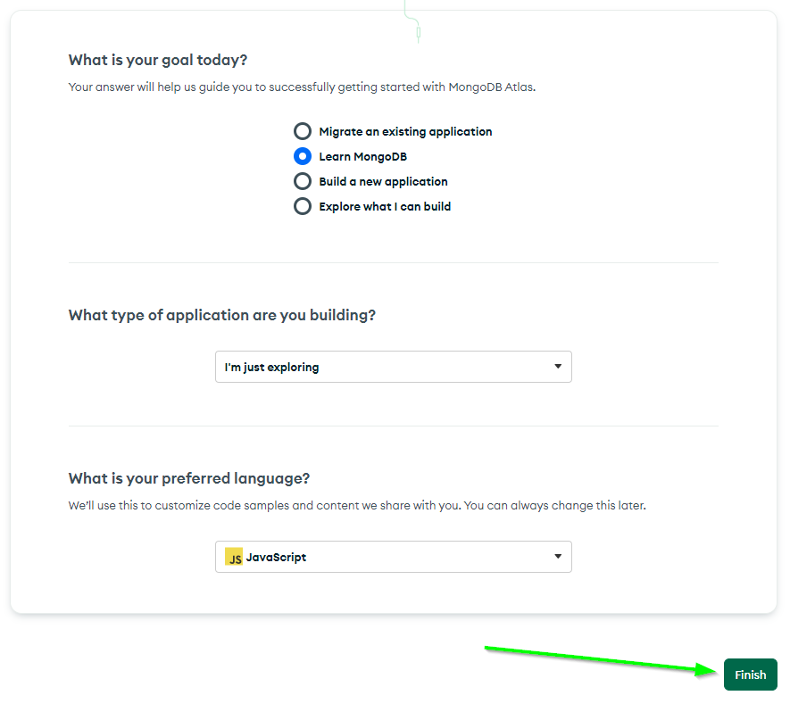
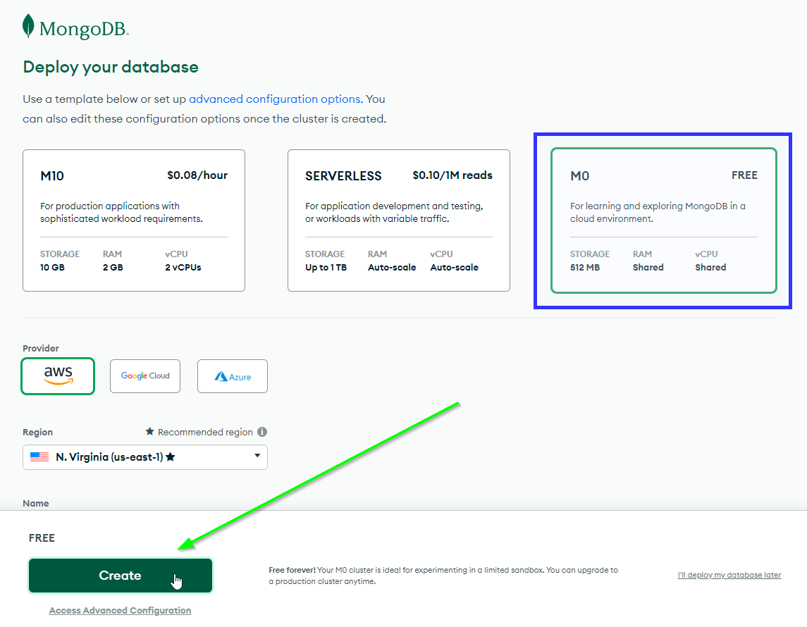
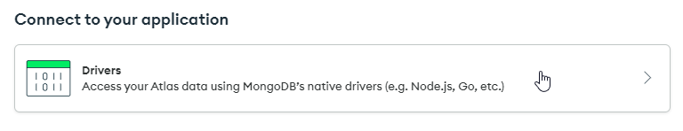

# MongoDB: Creating a Cluster using Atlas
Follow these instructions to set up a database for your project. You will want to go to the [Get Started with Atlas](https://www.mongodb.com/docs/atlas/getting-started/) guide and follow those instructions.

## Create an Atlas Account
Start by creating an account in MongoDB Atlas.

1. [Go here](https://www.mongodb.com/cloud/atlas/register)
1. Fill out the First Name, Last Name, Email, and Password fields, or Sign Up with Google
1. Agree to the terms and service and submit
1. Fill out the form in any way desired, and click the "Finish" button

## Deploy a Database Cluster
Now that you have an account, it should automatically redirect you to the database deployment page.

1. Select the **M0** free option
1. Click the "Create" button
1. Prove you are not a robot if needed

## Set Up the Database
Now that the database has been created, you will need to setup access rules.

1. Under "Security Quickstart" with "Username and Password" selected, enter a username and password  
  - Feel free to use the "Autogenerate Secure Password" button - just make sure to copy/remember the password!
1. Click "Create User"  
  
1. Scroll down to the "Where would you like to connect from?" section
1. Click the "Add My Current IP Address" button  
  
1. Click the "Finish and Close" button  
  
1. In the popup, click the "Go to Databases" button  
  

## Get a Connection String
Now the database should be ready to go! You just need a special URL to connect your application to it.

1. In the "Cluster0" deployment click the "Connect" button  
  
1. In the popup that appears, click the "Drivers" button  
  
1. Make sure "Node.js" is selected as the driver
1. Click the copy button next to the connection string  
  

## Update the .env File
Now all that's left is putting the string into the **back-end/.env** file in the project. This file should have been created during the [environment setup](EnvironmentSetup.md) by following the [instructions in the repository README](https://github.com/hto-projects/friendpardy#setting-up-the-environment-variables).

1. In the **back-end/.env** file, remove the string after `MONGO_URI=`
1. In its place, paste in the copied connection string surrounded by quotes
1. Replace `<password>` with the password for the user you created (make sure to get rid of the `<` and `>`)

That should be it! You should now be able to connect to your MongoDB Database from the application.
